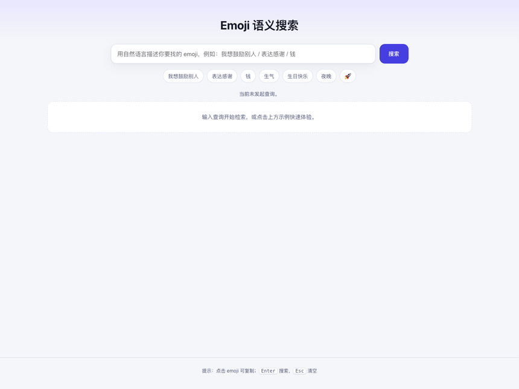

# Emoji 语义化搜索

用自然语言描述需求，找到最贴切的 emoji。

## 效果预览

在线体验：http://emoji.timegogo.top/

## 背景：为什么做这个

emoji 符号在文章中可以充当语义化锚点的作用，可以提升文章的阅读体验。但对于大多数写文章的人（For example, me）来说，想要寻找到语义贴切的 emoji 符号却不是一件容易的事情！

原因是因为 Mac 的「字符检视器」或其它输入法中虽然提供了 emoji 符号的搜索，但都是关键词匹配，同时它们给 emoji 符号绑定的关键词数量都极少，这意味着只有极少的关键词能够命中某一个 emoji 符号。此时，想要找到一个语义贴切的 emoji 符号，就需要人来完成“语义化检索”——根据自己的场景需求，联想可能的关键词，然后遍历搜索出能匹配上的 emoji。而这对于人的语文知识积累程度和想象力都是一个考验。

显然，解决的思路是将“语义化检索”这个任务，从人身上转移到技术/工具之上。

有没有现成的解决方案？网上搜索了一圈“Emoji 搜索、Emoji语义化搜索”，基本都是传统的关键词搜索。

社区有没有人做这个事情？在 GitHub 上按 "emoji/Emoji 搜索/Emoji 向量化搜索" ，并让 WorkBuddy 同步进行了相同的搜索任务，但结果是没有找到成熟可用的解决方案。

于是决定自己动手来解决这个痛点。

## 使用手册

👉 [技术架构与使用手册](./TECHNICAL.md)

## 部署指南

👉 [部署指南（Docker + 云服务器）](./DEPLOY.md)

## 数据来源与许可

`public/emoji_*.json` 为衍生数据：名称与关键词来自 [Unicode CLDR](https://cldr.unicode.org/) 中文注解，描述由 LLM 生成；相关 Unicode 数据采用 [Unicode License V3](https://www.unicode.org/license.txt)，再分发需保留版权声明。

- BAAI/bge-base-zh-v1.5 模型为 MIT 许可，不随本仓库分发
- 本项目与 Unicode, Inc. 无隶属关系，不使用其徽标或暗示任何形式的背书
